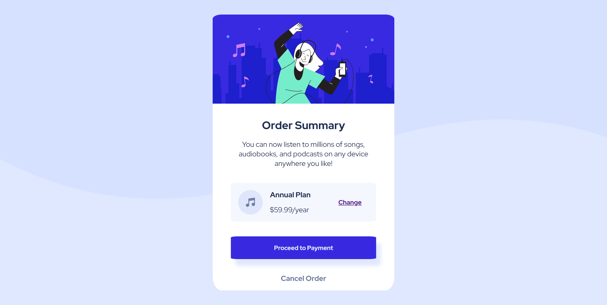
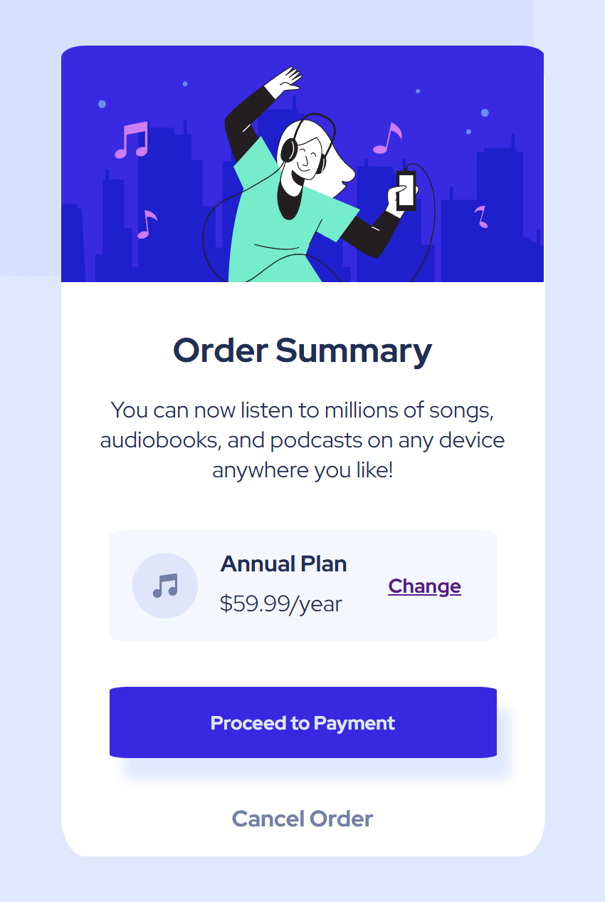

# Frontend Mentor - Order summary card solution

This is a solution to the [Order summary card challenge on Frontend Mentor](https://www.frontendmentor.io/challenges/order-summary-component-QlPmajDUj). Frontend Mentor challenges help you improve your coding skills by building realistic projects. 

## Table of contents

- [Overview](#overview)
  - [The challenge](#the-challenge)
  - [Screenshot](#screenshot)
  - [Links](#links)
- [My process](#my-process)
  - [Built with](#built-with)
  - [What I learned](#what-i-learned)
  - [Continued development](#continued-development)
  - [Useful resources](#useful-resources)
- [Author](#author)
- [Acknowledgments](#acknowledgments)

## Overview

### The challenge

Users should be able to:

- See hover states for interactive elements

### Screenshot

- Desktop 


- Mobile


- Link Hover State


- Payment Buttton Hover State


- Cancel Button Hover State


### Links

- Solution URL: (https://frontendmentor.io/profile/Duran144/solutions)

## My process

### Built with

- HTML5
- CSS
- Flexbox

### What I learned

```css
When resizing the screen my p elements would move out of position within the payment box, I fixed it using some flexbox properties to keep it in place.
.para-2{
    align-self: center;
    margin-top: -2rem;
    margin-left: 1rem;
    font-family: 'Red Hat Display-Bold';
    color: hsl(223, 47%, 23%);
}

.para-3{
    align-self: flex-end;
    margin-bottom: 1rem;
    margin-left: -5.6rem;
    font-family: 'Red Hat Display';
    color: hsl(223, 47%, 23%);
}

.change-link{
    align-self: center;
    margin-left: 4rem;
    font-family: 'Red Hat Display-Bold';
    font-size: 14px;
    color: hsl(245, 75%, 52%);
}
```


### Continued development

I want to improve on my website design skills

### Useful resources

- [Code Lab](https://www.youtube.com) - Code Lab helped me understand how to use flexbox correctly


## Author

- Frontend Mentor - [@Duran144](https://www.frontendmentor.io/profile/Duran144)
- Github - [Duran144](https://www.github.com/Duran144)
